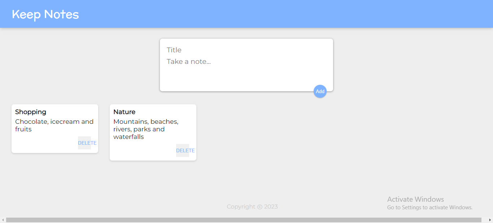

# Keep Notes Application

Simple note keeping application build using React Js as frontend and NodeJs Express as backend along with PostgreSQL database. CRUD Operations such to add, get and delete a note are implemented in this application.

## REST API Endpoints

### POST
[http://localhost:5000/note](http://localhost:5000/note)  

### GET
[http://localhost:5000/note](http://localhost:5000/note)

[http://localhost:5000/note/:id](http://localhost:5000/note/:id)  

### DELETE
[http://localhost:5000/note/:id](http://localhost:5000/note/:id)  

## APPLICATION SNAP

## CONCLUSION
The application holds the further scope for improvements.

